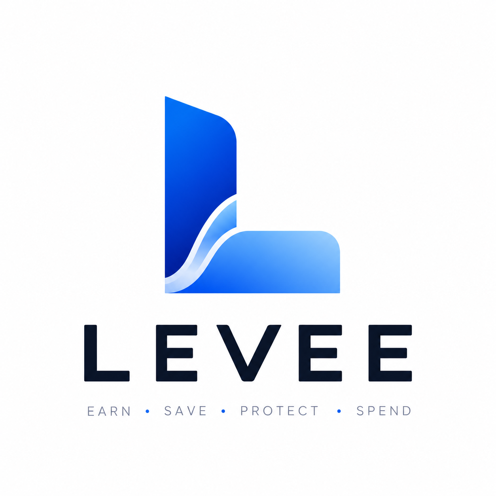

Levee holds money against a date and refuses to release it early.

## Live testnet

- App: [levee-seven.vercel.app](https://levee-seven.vercel.app)
- Contract: `0x736EBbB005de7b594DD082D026fa4e088e16d58E` on Ethereum Sepolia (chain ID `11155111`)
- Verified source: [eth-sepolia.blockscout.com/address/0x736EBbB005de7b594DD082D026fa4e088e16d58E](https://eth-sepolia.blockscout.com/address/0x736EBbB005de7b594DD082D026fa4e088e16d58E)
- Subgraph: [api.studio.thegraph.com/query/1760220/levee-sepolia/v0.0.1](https://api.studio.thegraph.com/query/1760220/levee-sepolia/v0.0.1)
- Public agent API: `GET /api/spend-check?wallet=<address>&amount=<eth>`

  ```
  curl "https://levee-seven.vercel.app/api/spend-check?wallet=0x8330bdfb84f72c364fd8083a3ac221ee642b85de&amount=0.001"
  ```

- OpenAPI spec: [levee-seven.vercel.app/api/openapi](https://levee-seven.vercel.app/api/openapi)
- Bazantic gateway: base URL `https://levee-seven.vercel.app`, spec URL `https://levee-seven.vercel.app/api/openapi`. See Bazantic below.

This is Sepolia testnet only. The ETH held by the contract has no monetary value.

## How it works

Sign-in is email or a social login through Privy. There is no seed phrase to write down or lose. Privy creates an embedded wallet on Ethereum Sepolia for the account on first login.

Depositing calls `deposit()` and moves ETH from that wallet into the Levee contract. Money sitting in the wallet itself is not protected by anything; Levee only manages funds once they are inside the contract.

Committing calls `commit(amount, unlockDate, label)`. It locks part of the contract balance against a future Unix timestamp and a text label (e.g. `"rent"`). `unlockDate` must be strictly in the future or the call reverts with `UnlockDateNotInFuture()`.

Free balance is `balanceOf[user] - committedOf[user]`: total deposited minus everything currently committed. Trying to spend more than free balance is refused: `spendFree()` reverts with `ExceedsFreeBalance()`, and the read-only `canSpend(user, amount)` function names which commitment is blocking it (its `label` and `unlockDate`) before any transaction is sent, so the UI can explain the refusal without spending gas.

Releasing calls `release(commitmentId)`. It only succeeds once `block.timestamp >= unlockDate` for that commitment; calling it earlier reverts with `NotYetUnlocked()`. A released commitment's amount moves back into free balance and can be spent immediately.

The contract holds a single asset, ETH, on a single chain: there is no token support and no cross-chain functionality. Held funds earn no yield; money inside the contract sits at exactly the balance it was deposited at until spent or released.

## Refusal policy

Every spend in the UI calls `canSpend(wallet, amount)` first and shows the blocking commitment's label and unlock date if the amount would exceed free balance, before attempting `spendFree()`.

The contract itself enforces the same rule independent of the UI: `spendFree()` reverts with `ExceedsFreeBalance()` for any caller who tries to spend past their own free balance, and `release()` reverts with `NotYetUnlocked()` for any caller, including the commitment's own owner, who tries to release before the unlock date. There is no admin function, owner override, or emergency withdraw that bypasses either check.

Commitments are bound to a wallet address, not a verified identity. Nothing in the contract or the app prevents someone from abandoning a wallet with active commitments and starting over with a new one.

## Ask Levee

The chat panel in the app (`components/ChatPanel.tsx`, served by `app/api/chat/route.ts`) is a natural-language interface over the same data the UI reads: live `freeBalance` and `commitmentsOf` reads from the contract, plus recent `Committed`/`Released`/`Spent` history from the Subgraph. Both are packed into a single prompt sent to Gemini (`gemini-3.6-flash`) with no tool-calling loop and no other data source. The system prompt instructs it to answer only from that data and never invent figures; it has no mechanism to fetch anything else.

An earlier version of this route fetched Subgraph history through The Graph's Subgraph MCP server over SSE. That worked in local development and was removed from the production code path entirely, because the SSE transport does not reliably complete its handshake in Vercel's serverless environment. It caused `/api/chat` requests to hang until Vercel's function timeout. The Subgraph history above is fetched with a plain HTTP POST instead, with no MCP client, no SDK, and no tool-calling loop.

## Agent interface

`GET /api/spend-check` (`app/api/spend-check/route.ts`) is a separate, unauthenticated endpoint built for AI agents rather than the chat UI. It combines two sources in one response: `allowed`, `freeBalance`, and `blockingCommitment` come from a live `canSpend`/`freeBalance` contract read; `upcomingObligations` comes from the Subgraph's indexed `Committed`/`Released` events. The response's `sources` field states which is which, so a caller doesn't have to guess which part is live and which part can lag.

## Stack

From `package.json`:

- Next.js 16.3.5, App Router
- React 19.2.8
- `@privy-io/react-auth` 3.42.0: embedded wallet auth
- `viem` 2.56.0: all contract reads/writes and Sepolia RPC access
- `framer-motion` 13.2.0: UI animation
- `lucide-react` 1.45.0: icons
- Tailwind CSS 4
- TypeScript 5
- Bazantic: x402 gateway and published Recipe over the spend-check endpoint

The Subgraph (`levee-sepolia/`) is a separate project using `@graphprotocol/graph-cli` 0.98.1 and `@graphprotocol/graph-ts` 0.37.0, deployed independently of the Next.js app.

Gemini is called directly over HTTP (`generativelanguage.googleapis.com`) from `app/api/chat/route.ts`. No AI SDK is installed for it.

## Local development

Requires Node. Developed and tested against v22.23.2. No Node version is pinned in `package.json`.

```
npm install
npm run dev
```

Required environment variables in `.env.local`:

- `NEXT_PUBLIC_PRIVY_APP_ID`: Privy app ID, used client-side for login.
- `GEMINI_API_KEY`: used server-side only, in `app/api/chat/route.ts`.

`GRAPH_GATEWAY_API_KEY` is not required. It was used by an earlier MCP integration that has since been removed from the code entirely. See Ask Levee above.

`npm run build` and `npm run lint` both need to pass with no errors before a change is considered done in this repo.

## Contract deployment

`contracts/Levee.sol` was compiled and deployed through Remix (see `contracts/DEPLOY.md` for the exact steps followed), not a CLI toolchain. It targets Solidity `^0.8.20` and is deployed to Ethereum Sepolia, chain ID `11155111`, not chain ID `10143`, which is unrelated to this project.

`contracts/DEPLOY.md` as written describes deploying to Base Sepolia (chain ID `84532`); that document does not match where the contract actually ended up. The live, verified deployment is Ethereum Sepolia at the address above.

## Privy

Authentication is configured in `components/PrivyProviders.tsx`, which wraps the app inside `app/layout.tsx`. The Privy app ID comes from `NEXT_PUBLIC_PRIVY_APP_ID`.

`loginMethods` is `["email", "google", "twitter", "discord", "github", "apple"]`: email plus five social logins. There is no `wallet` login method configured, so connecting an existing external wallet is not offered anywhere in the sign-in flow.

`embeddedWallets.ethereum.createOnLogin` is `"users-without-wallets"`, so every account that signs in gets a Privy-managed embedded wallet automatically, in practice every account, since no external wallet option exists to bring one instead. `defaultChain` and `supportedChains` are both set to `sepolia`; the embedded wallet only ever operates on Ethereum Sepolia.

## Subgraph

The Subgraph lives in `levee-sepolia/` as its own package, independent of the Next.js app's `package.json`.

```
cd levee-sepolia
npm install
npm run codegen
npm run build
npm run deploy
```

`npm run deploy` runs `graph deploy --node https://api.studio.thegraph.com/deploy/ levee-sepolia` and requires being authenticated with Subgraph Studio first (`graph auth`).

It indexes four events from the Levee contract, starting at block `11684853`: `Committed`, `Deposited`, `Released`, `Spent`.

## Bazantic

`/api/openapi` (`app/api/openapi/route.ts`) serves an OpenAPI 3.0.3 spec for `/api/spend-check`: its parameters, response shapes, and a description on every field, written for an agent deciding whether to call it.

Bazantic's gateway is configured against this app directly: base URL `https://levee-seven.vercel.app`, spec URL `https://levee-seven.vercel.app/api/openapi`, no auth, plain REST. The published Recipe is named `Levee Spend-Check API`, taken from the spec's `info.title`, and exposes one operation, `checkSpendability`: given a wallet and an ETH amount, whether that amount is spendable right now.

The Recipe combines two sources. The verdict (`allowed`, `freeBalance`, `blockingCommitment`) is a live read of `canSpend()` and `freeBalance()`, so it is never stale. `upcomingObligations` comes from the Subgraph instead, since the contract's `Commitment` struct has no transaction hash and the indexed event does. Every response's `sources` field states which half is which.
